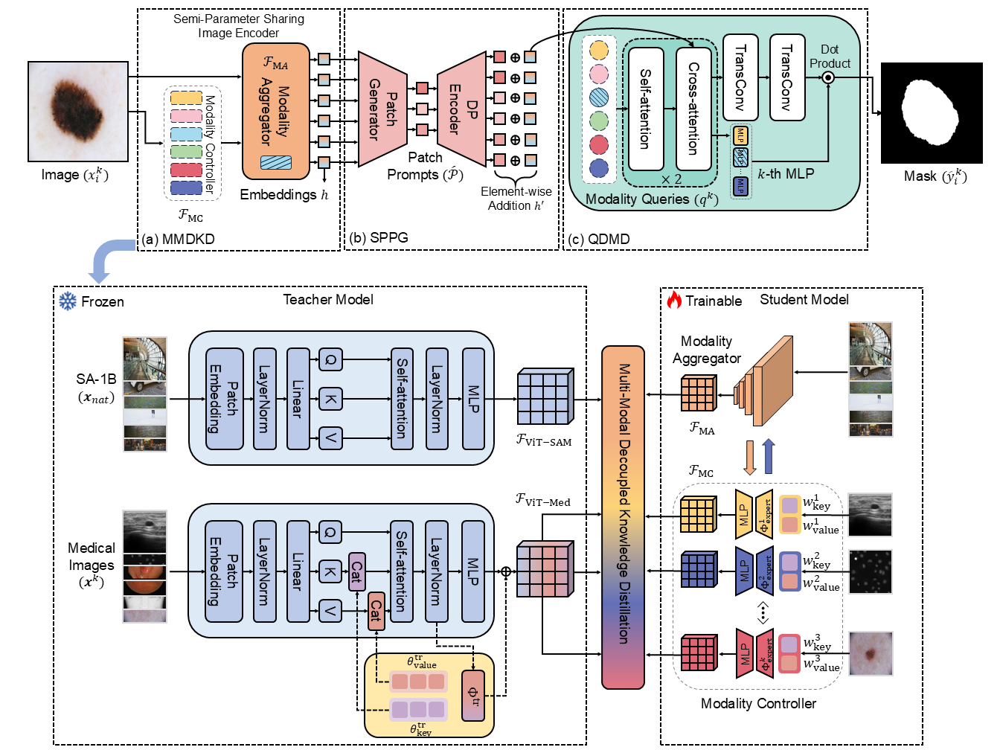

# ESP-MedSAM: Efficient Self-Prompting SAM for Universal Domain-Generalized Medical Image Segmentation

:pushpin: This is an official PyTorch implementation of **ESP-MedSAM: Efficient Self-Prompting SAM for Universal Domain-Generalized Medical Image Segmentation**

[[`arXiv`](https://arxiv.org/abs/2407.14153)] [[`BibTeX`](https://scholar.googleusercontent.com/scholar.bib?q=info:m1SgUw239yoJ:scholar.google.com/&output=citation&scisdr=ClFw2KpjEKieyAzytL0:AFWwaeYAAAAAZrn0rL2ppFHGbu1Xxj0lav_6C68&scisig=AFWwaeYAAAAAZrn0rNOsqsq5rY17-SQIAK7bscM&scisf=4&ct=citation&cd=-1&hl=en)]


<div align="center">
    
</div>

## 📰News

**[2024.08.08]** The pre-print paper has been uploaded!

**[2024.08.07]** Paper will be updated soon!

**[2024.08.07]** Code and model checkpoints are released!

## 🛠Setup

```bash
git clone https://github.com/xq141839/ESP-MedSAM.git
cd ESP-MedSAM
conda create -n ESP python=3.10
conda activate ESP
conda install pytorch==1.13.0 torchvision==0.14.0 torchaudio==0.13.0 pytorch-cuda=11.6 -c pytorch -c nvidia
pip install albumentations==0.5.2
pip install pytorch_lightning==1.1.1
pip install monai
```

**Note**: Please refer to requirements.txt


## 📚Data Preparation

The structure is as follows.
```
ESP-MedSAM
├── datasets
│   ├── image_1024
│     ├── ISIC_0000000.png
|     ├── ...
|   ├── mask_1024
│     ├── ISIC_0000000.png
|     ├── ...
```

## 🎪Segmentation Model Zoo
We provide all pre-trained models here.
| MA-Backbone | MC | Checkpoints |
|-----|------|-----|
|TinyViT| Dermoscopy | [Link](https://nottinghamedu1-my.sharepoint.com/:f:/g/personal/scxqx1_nottingham_edu_cn/EpOiC2oi8eFFuUqCK_JlSD0BKCn0oHYsVW83sg-fzZUx6w?e=0SHI0m)|
|TinyViT| X-ray | [Link](https://nottinghamedu1-my.sharepoint.com/:f:/g/personal/scxqx1_nottingham_edu_cn/EpOiC2oi8eFFuUqCK_JlSD0BKCn0oHYsVW83sg-fzZUx6w?e=0SHI0m)|
|TinyViT| Fundus | [Link](https://nottinghamedu1-my.sharepoint.com/:f:/g/personal/scxqx1_nottingham_edu_cn/EpOiC2oi8eFFuUqCK_JlSD0BKCn0oHYsVW83sg-fzZUx6w?e=0SHI0m)|
|TinyViT| Colonoscopy | [Link](https://nottinghamedu1-my.sharepoint.com/:f:/g/personal/scxqx1_nottingham_edu_cn/EpOiC2oi8eFFuUqCK_JlSD0BKCn0oHYsVW83sg-fzZUx6w?e=0SHI0m)|
|TinyViT| Ultrasound | [Link](https://nottinghamedu1-my.sharepoint.com/:f:/g/personal/scxqx1_nottingham_edu_cn/EpOiC2oi8eFFuUqCK_JlSD0BKCn0oHYsVW83sg-fzZUx6w?e=0SHI0m)|
|TinyViT| Microscopy | [Link](https://nottinghamedu1-my.sharepoint.com/:f:/g/personal/scxqx1_nottingham_edu_cn/EpOiC2oi8eFFuUqCK_JlSD0BKCn0oHYsVW83sg-fzZUx6w?e=0SHI0m)|


## 🎈Acknowledgements
Greatly appreciate the tremendous effort for the following projects!
- [SAM](https://github.com/facebookresearch/segment-anything)
- [TinyViT](https://github.com/microsoft/Cream/tree/main/TinyViT)

## 📜Citation
If you find this work helpful for your project, please consider citing the following paper:
```
@article{xu2024esp,
  title={ESP-MedSAM: Efficient Self-Prompting SAM for Universal Domain-Generalized Medical Image Segmentation},
  author={Xu, Qing and Li, Jiaxuan and He, Xiangjian and Liu, Ziyu and Chen, Zhen and Duan, Wenting and Li, Chenxin and He, Maggie M and Tesema, Fiseha B and Cheah, Wooi P and others},
  journal={arXiv preprint arXiv:2407.14153},
  year={2024}
}
```
